# @4242labs/pi-tron-clu

[](https://www.repostatus.org/#wip)
[](CONTRIBUTING.md)
[](LICENSE)
[](https://www.npmjs.com/package/@4242labs/pi-tron-clu)

TRON-CLU for [Pi](https://github.com/earendil-works/pi-mono) — a supervisor extension that
drives a fleet of Pi seats through a build → review → merge pipeline, one block at a time,
and **stops at every merge to ask you**.

<p align="center">
  
</p>

> **Pre-v1.** The driver, the seats, the law and the memory adapter are built and tested, and
> one three-block pilot has run end to end on a private sandbox. Seats are not contained yet —
> see [docs/containerization.md](docs/containerization.md) before pointing it at work you care
> about.

## What it does

You give CLU a mandate: an ordered list of blocks. Each block is a task, a branch, and a set
of acceptance criteria — where every criterion carries the **command that decides it**, so
"done" is never a judgement call.

For each block, in order:

1. a **worker seat** builds it in its own git worktree and commits;
2. the **gates** run in a fresh detached checkout of what was committed — never in the
   worker's live worktree, so uncommitted work cannot reach a gate;
3. a **reviewer seat** reads the diff, the evidence, and the protected paths the change
   touched, and returns APPROVED or REJECTED with its reasons;
4. the branch is pushed and the run **parks**. Nothing merges until you say so.

A rejection sends the block back to the same worker seat with the reviewer's own words as its
brief. A wall the driver cannot clear — a retry cap, a spent budget, a block file edited
underneath it — parks an escalation with a fixed set of answers, and waits.

## The one rule

**A seat never lands work.** That is held three ways, in order of strength: the tool
allowlist Pi enforces from the parent process, the parked merge that no code path can clear,
and a pattern-matching deny extension that is *bypassable and documented as such*.
[docs/law.md](docs/law.md) states exactly where each stops working, and which one is
load-bearing (it is you).

## Install

```bash
pi install npm:@4242labs/pi-tron-clu
```

Then, in a Pi session at the root of a git repository:

```
/tron-clu init                 # gates, branch, merge strategy — written to .pi/tron-clu.json
/tron-clu ./blocks/mandate.json # start a mandate
/tron-clu status               # where it is
/tron-clu approve <block>      # the merge. TUI only, always
/tron-clu reject <block> <why>
/tron-clu answer <item> <choice>
```

`approve`, `reject`, `answer` and starting a mandate are **TUI-only**: there is no
programmatic path to starting a run or approving a merge.

## A block

```json
{
  "id": "b1-titlecase",
  "task": "Add a titleCase function to src/kit.js and export it…",
  "reviewerClass": "code",
  "acceptance": [
    { "criterion": "titleCase is exported", "verify": "node -e \"…\"" },
    { "criterion": "the whole suite passes", "verify": "npm test" }
  ]
}
```

A criterion with no `verify` command is refused: a criterion no command can check is not a
criterion. So is an unknown field — a typo is a reason not to run.

## What it does not do

- **It does not decide.** No timeout resolves a merge or an escalation. Silence keeps a run
  parked forever, on purpose.
- **It does not contain its seats.** A worker seat has `bash`, and `bash` reaches the network
  and the filesystem. See [docs/containerization.md](docs/containerization.md) — evaluated,
  deferred, with the conditions for adopting it named.
- **It does not run seats in parallel.** One block at a time, in the mandate's order.

## Documentation

| | |
|:--|:--|
| [docs/law.md](docs/law.md) | what a seat cannot do, and where that stops being a guarantee |
| [docs/drills.md](docs/drills.md) | every failure this design claims to survive, and the test that proves it |
| [docs/pi-api.md](docs/pi-api.md) | the verified Pi contract this is built against |
| [docs/memento-adapter.md](docs/memento-adapter.md) | what the supervisor remembers, and what it must not |
| [docs/containerization.md](docs/containerization.md) | seat containment: evaluated and deferred |
| [docs/publishing.md](docs/publishing.md) | how this reaches npm and Pi's gallery |

## Requirements

- pi **0.84.1** or later (the verified baseline)
- git 2.5+ (worktrees)
- `gh`, for the `pr` and `squash` merge strategies

## License

Open source — [Apache-2.0](LICENSE).

---
If it earned its keep, [coffee is appreciated](https://buymeacoffee.com/42piratas). ☕
